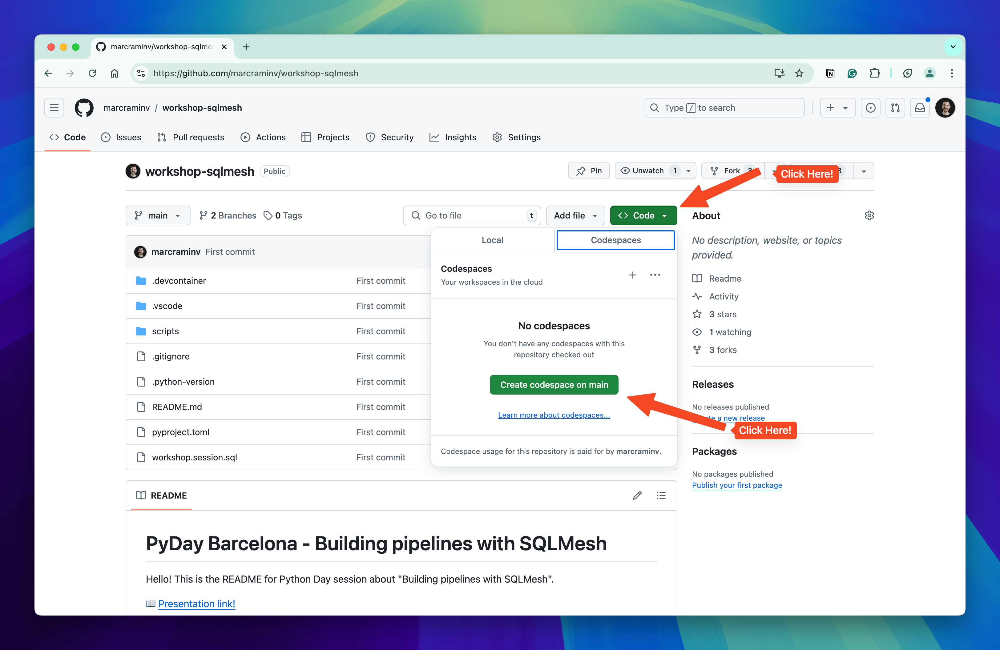
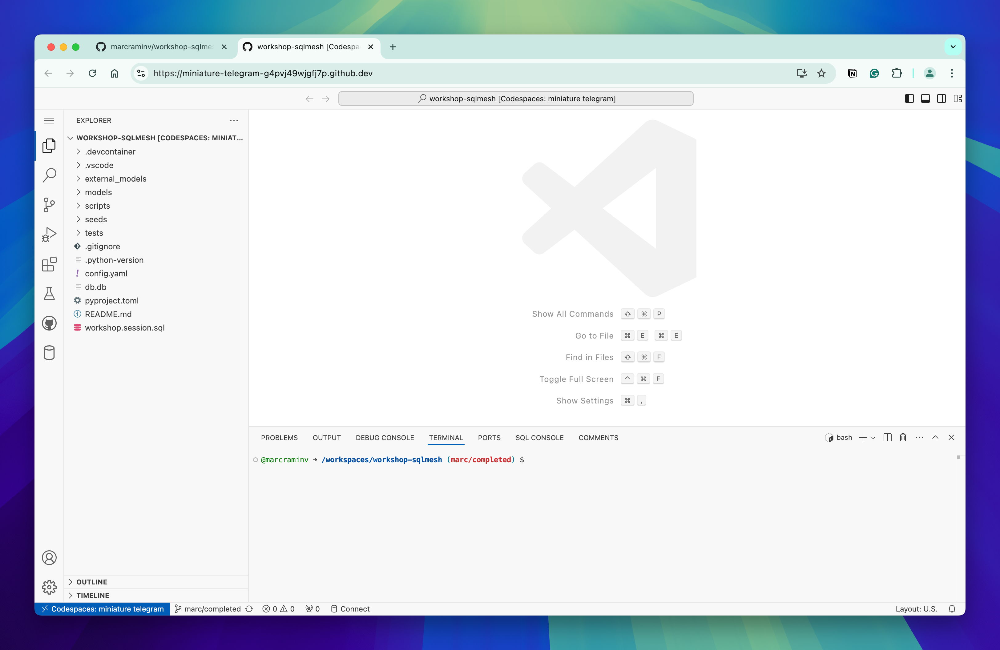
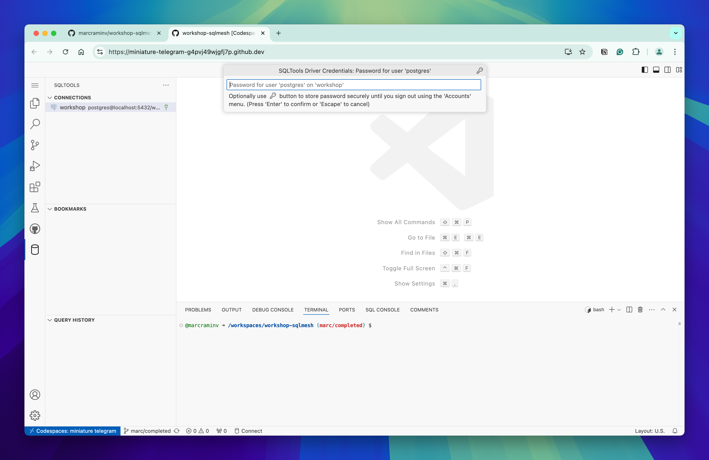
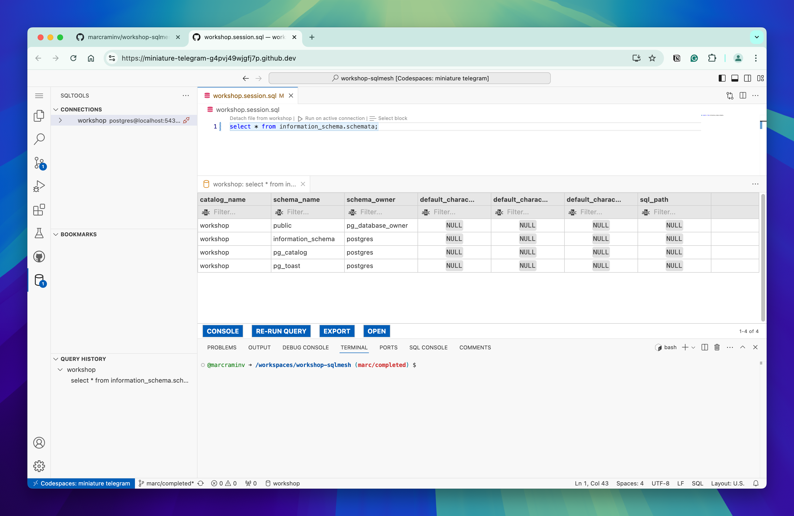
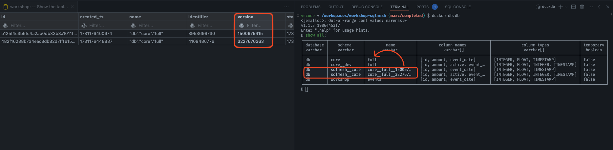

# Building pipelines with SQLMesh - workshop

Hello 👋 This is the README for "Building pipelines with SQLMesh" workshop. This document is the main place to follow all the workshop instructions.

SQLMesh is a relative new python library, and it tries to introduce concepts and good practices adopted from other mainstream tools like Terraform. This is a similar tool to DBT, but with a different approach. DBT is stateless, SQLMesh is not. A main feature SQLMesh offers to developers is to verify (with plan command) what is going to happen before the execution (More or less as Terraform work with Infrastructure as code).

This repository provides you with all the necessary tools to explore the SQLMesh library and all the features it has. The repository will load a sample records on a duckdb databases named `db.db`. The user will have SQLTool extension ready to access to the Postgres database that will store a lot interesting information about what you will be doing.

**Let's start!** 🏎️

### Step: Open Github Codespaces

Let's start opening the environment with Codespaces. It is really straightforward, you only need to click on *`Code`* button, and then *`Create Codespace`* on branch `main`.

> [!CAUTION]
> I assume you will have credits to run Codespaces.
> _"GitHub will provide users in the free plan 120 core hours or 60 hours of run time on a 2 core codespace, plus 15 GB of storage each month"_
>
> If not, people can run this project using DevContainers locally installing the proper [VSCODE extension](https://marketplace.visualstudio.com/items?itemName=ms-vscode-remote.vscode-remote-extensionpack).




You will see that a visual studio code opens on the browser



### Step: Create SQLMesh project

Uau! Setup ready, congratulations! This was a really important 👏🏻.

Now it's time to initialize the SQLMesh project. We will use [*uv*](https://docs.astral.sh/uv/) python package manager for this.

```
uv tool run sqlmesh init -t empty duckdb
```

This command will initialize an empty SQLMesh project with all the proper folders to use during the tutorial.

### Step: Define the state connection

It's time to explore the [**`config.yml`**](config.yaml). This file is generated by `sqlmesh init` command with some default values. By default we will use _DuckDB_ as the main data storage to save our models. You can define multiple gateways, but you must use one as default.

```yml
gateways:
  local:
    connection:
      type: duckdb
      database: db.db

default_gateway: local

model_defaults:
  dialect: duckdb
  start: 2024-11-01
```

As we mentioned before, SQLMesh use state to control what or not is executed. By default we can use DuckDB, but given concurrency limitations the connection may hang.

> _"DuckDB does not support concurrent connections, so it may "hang" when used as a state database if the primary connection's concurrent_tasks value is greater than 1."_

Given this consideration, we preferred to use a transactional db, a postgreSQL instance.

```diff
gateways:
  local:
    connection:
      type: duckdb
      database: db.db
+   state_connection:
+     type: postgres
+     host: db
+     port: 5432
+     user: postgres
+     password: postgres
+     database: workshop

default_gateway: local

model_defaults:
  dialect: duckdb
  start: 2024-11-01
```

A postgres instance is available as well, and we have access to the SQLTool extension to query the data. Try to check that you have access. CLick on the SQLTool vscode extension (left panel) and connect. the browser will ask for the password.



Once you are connected, run a simple query to check basic database information.



Cool 👌! Everything ready to start with SQLMesh models.

### Step: Define an external model

As any other Data project, we need source data. We added some fake data to an initial duckdb database. Easy to access with command `duckdb db.db`, then run the query:

```sql
select * from workshop.events
```

This data source is covered under the `External model` option in SQLMesh. Any model not managed by SQLMesh can be defined via [**`yaml`**](./external_models/external_models.yaml) file. In this file we define the gateway namespace, the table name, and the column types.

```yaml
- name: '"db"."workshop"."events"'
  gateway: local
  columns:
    id: INT
    amount: FLOAT
    event_date: TIMESTAMP
```

Now SQLMesh is aware of this source table.

### Step: Build the first SQL model

Now, create a simple [`FULL` SQL model](./models/full_model.sql) to query the `EXTERNAL` model.

```sql
MODEL (
  name core.full,
  kind FULL,
  cron '@daily'
);

SELECT
  id,
  amount,
  event_date
FROM workshop.events
```

Once this model is defined, we are ready to apply our plan on the actual environment.

### Step: Running the first plan on Prod

```bash
uv run sqlmesh plan
```

Output:
```
======================================================================
Successfully Ran 1 tests against duckdb
----------------------------------------------------------------------
New environment `prod` will be created from `prod`
Summary of differences against `prod`:
Models:
└── Added:
    └── core.full
Models needing backfill (missing dates):
└── core.full: 2024-11-01 - 2024-11-08
Apply - Backfill Tables [y/n]: 
```

### Step: Modify the previous SQL model

```diff
MODEL (
  name core.full,
  kind FULL,
  cron '@daily'
);

SELECT
  id,
  amount,
+  1 as active,
  event_date
FROM workshop.events
```

### Step: Run the dev plan

```bash
uv run sqlmesh plan dev
```

Output:
```
======================================================================
Successfully Ran 1 tests against duckdb
----------------------------------------------------------------------
Summary of differences against `dev`:
Models:
└── Directly Modified:
    └── core__dev.full
---
+++
@@ -7,6 +7,6 @@ 
SELECT
id,
amount,

+ 1 AS active,

event_date
 FROM workshop.events
Directly Modified: core__dev.full (Breaking)
Models needing backfill (missing dates):
└── core__dev.full: 2024-11-01 - 2024-11-08
Enter the backfill start date (eg. '1 year', '2020-01-01') or blank to backfill from the beginning of history: 
```
Take a minute to check what happened on the state database (PotgreSQL instance). 

```sql
-- Query on Postgres

select * from sqlmesh._snapshots;
```

On the following picture we can see that SQLMesh created 2 rows with different version number on `_intervals` table. That makes completely sense! We modified the `core.full` model introducing a breaking change, so a new variant was created. At the same time we can see the view living on the virtual layers. `core.full` on the prod environment, and `core__dev` on the dev environment. Checking the `CREATE STATEMENT` on duckdb we see:



At the same time we can see the view living on the virtual layers. `core.full` on the prod environment, and `core__dev` on the dev environment. Checking the `CREATE STATEMENT` on duckdb we see:

```
D .schema
```
Output:

```sql
-- CREATE TABLE FOR EXTERNAL MODEL
CREATE TABLE workshop.events(id INTEGER, amount FLOAT, event_date TIMESTAMP);

-- CREATE PHYSICAL TABLES (KNOWN AS SNAPSHOTS) ON PHYSICAL LAYER
CREATE TABLE sqlmesh__core.core__full__1500675415(id INTEGER, amount FLOAT, event_date TIMESTAMP);
CREATE TABLE sqlmesh__core.core__full__3227676363(id INTEGER, amount FLOAT, active INTEGER, event_date TIMESTAMP);

-- CREATE VIEWS FOR EACH VIRTUAL LAYER
CREATE VIEW core."full" AS SELECT * FROM db.sqlmesh__core.core__full__3227676363;
CREATE VIEW core__dev."full" AS SELECT * FROM db.sqlmesh__core.core__full__3227676363;
```

### Step: Validate data

```bash
uv run sqlmesh fetchdf "select * from core__dev.full"
```

Output:
```

     id  amount  active          event_date
0   101  150.00       1 2024-11-01 00:00:00
1   102  200.50       1 2024-11-01 00:00:00
2   101  175.25       1 2024-11-02 00:00:00
3   103  300.75       1 2024-11-02 00:00:00
4   102  250.00       1 2024-11-03 00:00:00
5   103  320.00       1 2024-11-03 00:00:00
6   101  160.50       1 2024-11-04 00:00:00
7   102  210.25       1 2024-11-04 00:00:00
8   101  180.75       1 2024-11-05 00:00:00
9   103  340.00       1 2024-11-05 00:00:00
10  101  175.25       1 2024-11-06 00:00:00
11  103  300.75       1 2024-11-06 00:00:00
12  103  300.75       1 2024-11-06 15:00:00
```


### Step: Build the first Incremental models

```sql
MODEL (
  name core.inc,
  kind INCREMENTAL_BY_TIME_RANGE (
    time_column event_date
  ),
  cron '*/5 * * * *'
);

SELECT
  event_date,
  SUM(amount) AS total_amount
FROM workshop.events
WHERE
  event_date BETWEEN @start_dt AND @end_dt
GROUP BY
  event_date
```

```
uv run sqlmesh plan
```

Output:
```
New environment `prod` will be created from `prod`
Summary of differences against `prod`:
Models:
└── Added:
    ├── core.inc
    └── workshop.events
Models needing backfill (missing dates):
└── core.inc: 2024-11-01 00:00:00 - 2024-11-09 20:14:59
```

### Step: Check how incremental interval works

Insert new records on source table `db.workshop.events` representing the next interval that will be processed. The last interval processed based on the `sqlmesh plan` was **`2024-11-09 20:14:59`**, then we need to create samples like:

```sql
insert into workshop.events (event_date, id, amount) values ('2024-11-09 20:16:00', 101, 175.25);
insert into workshop.events (event_date, id, amount) values ('2024-11-09 20:17:00', 103, 300.75);
insert into workshop.events (event_date, id, amount) values ('2024-11-09 20:18:00', 103, 300.75);
```

You will have to modify the `YYYY-mm-dd HH:mm:ss` depending when you are running this tutorial.

### Step: Execute the run command

> _if a model’s cron is daily then sqlmesh run will only execute the model once per day. If you issue sqlmesh run the first time on a day the model will execute; if you issue sqlmesh run again nothing will happen because the model shouldn’t be executed again until tomorrow._

Processing incrementals has a hard dependency on the cron definition. This makes a lot of sense because the processing model in SQLMesh is by time intervals and not higher watermarks. Then, testing how the incremental model works needs the step [defined previously](#step-check-how-incremental-interval-works)

```sh
watch -n 30 uv run sqlmesh run
```

Output:
```
Every 30.0s: uv run sqlmesh run 
5ddcb8705ed5: Sat Nov  9 20:25:16 2024
[1/1] core.inc evaluated in 0.02s
Evaluating models ━━━━━━━━━━━━━━━━━━━━━━━━━━━━━━━━━━━━━━━━ 100.0% • 1/1 • 0:00:00

All model batches have been executed successfully

```

### Step: Validate data

```bash
uv run sqlmesh fetchdf "select * from core.inc"
```

Output:
```diff
           event_date  total_amount
  0 2024-11-01 00:00:00        350.50
  1 2024-11-02 00:00:00        476.00
  2 2024-11-03 00:00:00        570.00
  3 2024-11-04 00:00:00        370.75
  4 2024-11-05 00:00:00        520.75
  5 2024-11-06 00:00:00        476.00
  6 2024-11-06 15:00:00        300.75
+ 7 2024-11-09 20:16:00        175.25
+ 8 2024-11-09 20:17:00        300.75
+ 9 2024-11-09 20:18:00        300.75
```